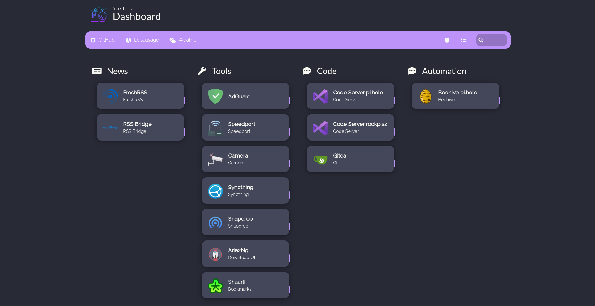

# homer-dracula-styling

This is a dracula theme template for your [Homer Dashboard](https://github.com/bastienwirtz/homer)

# Installation
1. copy `config.yml` and `custom.css` to the assets folder
1. apply your own configuration of services as described here: [Configuration](https://github.com/bastienwirtz/homer/blob/main/docs/configuration.md) 
